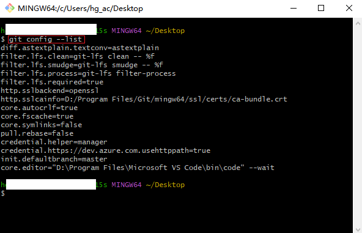
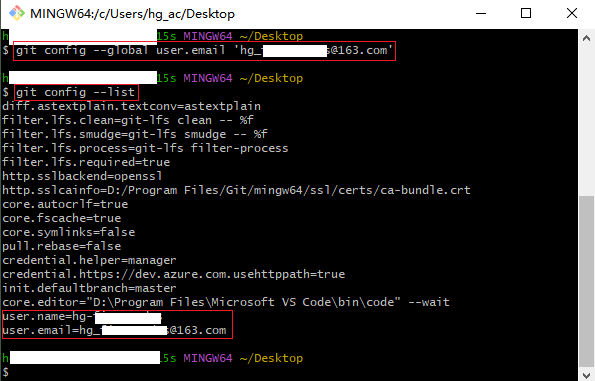
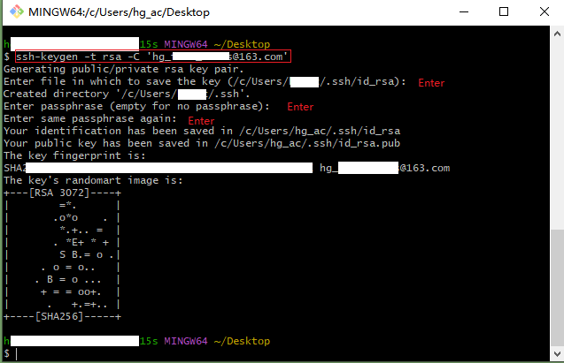
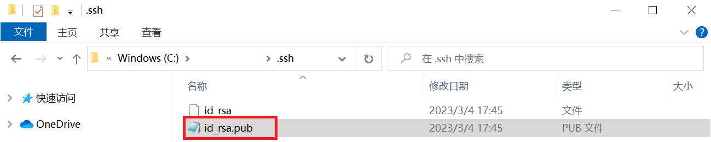
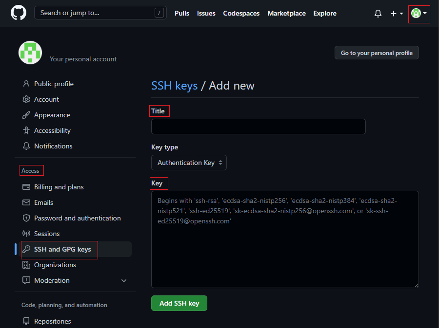
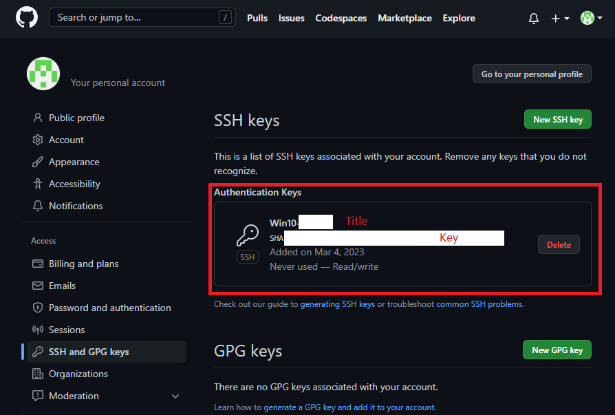

# How to use GitHub

/*

* File: how to use GitHub.md
* Project: GitHub学习笔记
* File Created: Saturday, 4th March 2023 5:10:38 pm
* Author: Hanlin Gu (hg_fine_codes@163.com)
* -----
* Last Modified: Saturday, 4th March 2023 5:11:46 pm
* Modified By: Hanlin Gu (hg_fine_codes@163.com>)
 */
<!-- TOC -->

* [1. Unable to open GitHub in China](#1-unable-to-open-github-in-china)
  * [1.1. Method 1: change DNS](#11-method-1-change-dns)
    * [1.1.1. find DNS address](#111-find-dns-address)
* [2. No `.ssh` folder under GitHub folder](#2-no-ssh-folder-under-github-folder)
  * [2.1. Login GitHub in local](#21-login-github-in-local)
* [3. Change the folder name in local](#3-change-the-folder-name-in-local)
  * [3.1. Find local folder `.ssh`](#31-find-local-folder-ssh)
  * [3.2. Copy the repository's SSH address](#32-copy-the-repositorys-ssh-address)
  * [3.3. Change Directory Name](#33-change-directory-name)

<!-- /TOC -->

<div style="page-break-after:always"></div>

## 1. Unable to open GitHub in China

### 1.1. Method 1: change DNS

>[github打不开？不改host也可以](https://blog.csdn.net/AE_yang/article/details/122995471?ops_request_misc=&request_id=&biz_id=102&utm_term=github%E6%89%93%E4%B8%8D%E5%BC%80&utm_medium=distribute.pc_search_result.none-task-blog-2~all~sobaiduweb~default-0-122995471.nonecase&spm=1018.2226.3001.4187)

#### 1.1.1. find DNS address

Find the DNS for GitHub from <http://tool.chinaz.com/dns/>, in A search `github.com` and get the fastest ip (ip with smallest TTL value)


## 2. No `.ssh` folder under GitHub folder

> [使用本地Windows创建密钥连接GitHub时发现你的git根目录里没有.ssh文件夹怎么办](https://blog.csdn.net/shame_Joker/article/details/109702083?ops_request_misc=%257B%2522request%255Fid%2522%253A%2522167792128616782427440049%2522%252C%2522scm%2522%253A%252220140713.130102334.pc%255Fall.%2522%257D&request_id=167792128616782427440049&biz_id=0&utm_medium=distribute.pc_chrome_plugin_search_result.none-task-blog-2~all~first_rank_ecpm_v1~rank_v31_ecpm-1-109702083-null-null.nonecase&utm_term=windows%20.ssh%E6%96%87%E4%BB%B6%E5%A4%B9%E5%9C%B0%E5%9D%80&spm=1018.2226.3001.4187)

### 2.1. Login GitHub in local

Right click on the desktop and click `Git Bash Here`.

Check whether there's any GitHub account associated with this machine.

```shell
git config --list
```



In general, there would be no account information `user name` and `user email` if no specific setup.

Setup a local user name and email. Change the `your_user_name` and `your_email_address` according to your own information.

```shell
git config --global user.name 'your_user_name'
```

```shell
git config --global user.email 'your_email_address'
```


At this point, there is still no `.ssh` folder yet.

```shell
ssh-keygen -t rsa -C 'your_email_address'
```



The second line `Enter passphrase (empty for no passphrase)` is to set up the password. If you don't want to key in password every time, then simply hit `enter` all the way.

Now there is `.ssh` folder under your `user` folder, and you can setup ssh function in GitHub,

## 3. Change the folder name in local

### 3.1. Find local folder `.ssh`

Open the folder `C:\Users\computer_user\.ssh`, the `computer_user` is the current user of your computer.

Find `id_rsa.pub` file and open it. Note that `.pub` can be opened with `Text`.



Copy the ssh key into the GitHub setting.

In GitHub `Setting` $\rightarrow$ `Access`, click `SSH and GPG keys`

Click `New SSH key`, give it a title name and paste the ssh key in the key box.





### 3.2. Copy the repository's SSH address

Go to the website of your repository that you would like to change.


In Windows Powershell `git clone "ssh_address"`

```shell
git clone "git@github.com:hg-fine-codes/python-study-beginner.git"
```


### 3.3. Change Directory Name

(1) Go to your cloned folder address. Change the `old_name` folder name into `new_name`.

```shell
git mv old_name new_name
```

(2) Submit Comment with the change

```shell
git commit -m "change folder name"
```

(3) Update

```shell
git push
```


Then the name of the target folder is changed.

If there shows `Fatal: Could not read from remote repository`,

```shell
ping github.com
```

And push again will solve this problem.

```shell
git push
```
